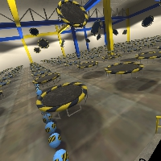
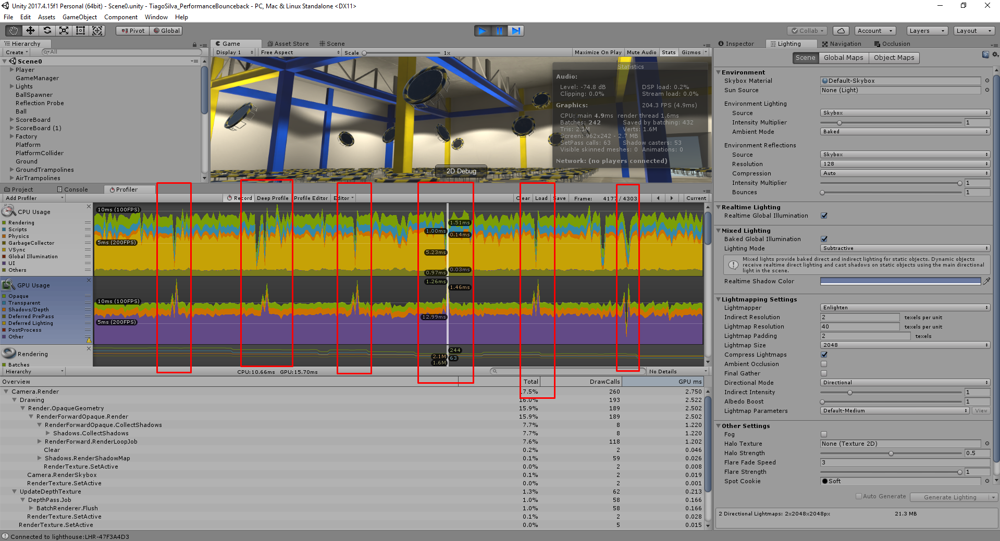

# Performance Bounceback Project for HTC VIVE by Tiago Silva
## [Udacity's VR Developer High Immersion course](https://www.udacity.com/course/vr-high-immersion-nanodegree--nd107) - Term 3 Project 2

## Why this project?
Performance optimization is one of the most important skillsets for a VR developer. This project simulates a real-world scenario where a VR game has been hastily built with a focus on functionality rather than performance (a common approach while prototyping) - I had to make it performant ready for release.

## How long it took
It took approximately 3 days of full time work to complete.

## What did I learn?
- Using static and dynamic batching
- Optimizing physics
- Creating object pools
- Caching variables and optimizing code
- Setting up lighting with MSAA
- Baking lighting
- Using light probes
- Using the profiler for performance optimization

## Final thoughts on the game
I enjoyed watching the number of fps increase slowly as I was developing the game. Simple changes can have tremendous impact in our game. And I liked the fact that now we have tools to analyse our performance issues.
I did not enjoy lighting that much because I think it should have been more spoken in this course. 

## Problems with this project
The hardest part for me was understanding why do I have GPU spikes. It wasn't until I tested the profiler in a development build that I saw all of them disappearing. I can't understand from the profiler in the unity setting I could arrive to that conclusion.

## Improvements for the future
- Add a timer and a target number of points for players. 
- Add some sounds to make the experience more enjoyable, and the score on the walls while playing.
- Customize the particle effects that appear when players score points.
- Create a button that resets the score.
- Add a "score multiplier" that floats in the scene somewhere. When hit with a ball, it disappears all points scored within a short time are multiplied.

## Versions
- SteamVR 1.2.10
- Unity 2017.4.15f1